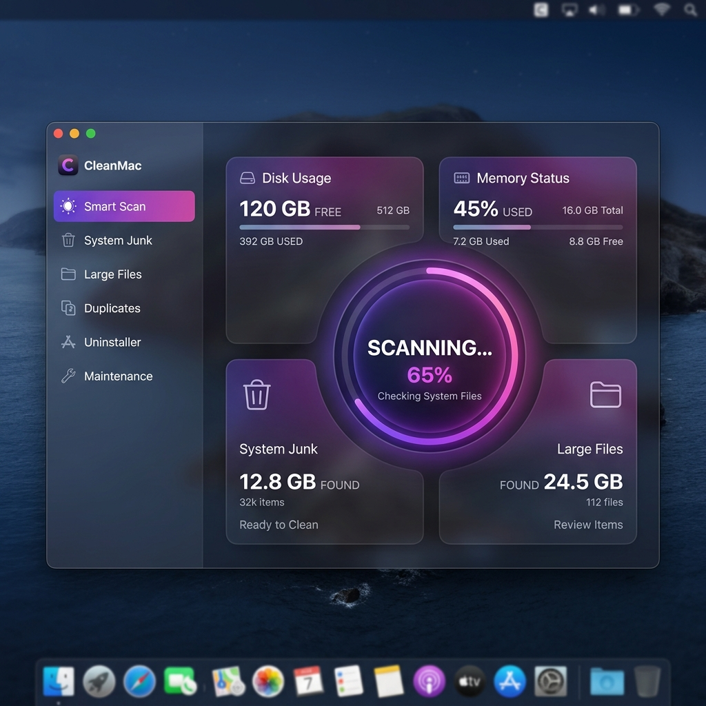

# CleanMac 🍃

[](https://opensource.org/licenses/MIT)
[](https://swift.org)
[](https://apple.com)

**CleanMac** is a modern, open-source, privacy-first utility for macOS built entirely in SwiftUI. It provides an efficient and transparent way to clean junk, find duplicates, manage installed applications, and run system optimization tasks, without telemetry or subscription fees.

---

## ✨ Features

* 🚀 **Smart Scan:** A comprehensive one-click scan targeting system caches, user logs, Xcode derived data, browser history, and temporary items.
* 📦 **Uninstaller:** Fully uninstall applications and scan for orphaned leftovers left behind by deleted apps.
* 🔍 **Large Files Finder:** Instantly isolate large files (50MB+) taking up precious storage on your drive.
* 👯 **Duplicate Finder:** Detect byte-for-byte duplicate files utilizing SHA256 cryptographic hashing.
* 🔒 **Privacy Cleaner:** Easily clear browser history, cookie structures, download history, and system-wide recent item lists.
* 🛠️ **System Maintenance:** Purge inactive RAM, repair disk permissions, verify volumes, and flush DNS caches via shell integrations.
* ⚙️ **Menu Bar Utility:** A lightweight menu bar window showing real-time disk and RAM stats, with quick purge shortcuts.

---

## 🎨 Preview

The app features a premium dark-themed interface built using "Glassmorphism" material styling, layout scaling, and responsive hover feedback.



*Includes:*
* Interactive category cards on the Home Dashboard.
* Safe category checkmarks and individual file verification selectors.
* Dynamic Disk and Memory monitoring indicators.

---

## 🛠️ Build & Installation

To run or build CleanMac locally:

### Option A: Compiling via Terminal
1. Clone this repository:
   ```bash
   git clone https://github.com/nathmantosh/cleanmac.git
   cd cleanmac/CleanMac
   ```
2. Compile the binary:
   ```bash
   swiftc -o CleanMac Sources/CleanMacApp.swift Sources/Services/AppManager.swift Sources/Services/FileAnalyzer.swift Sources/Services/JunkScanner.swift Sources/Views/ContentView.swift Sources/Views/MenuBarView.swift Sources/Views/SettingsView.swift
   ```
3. Launch the compiled binary:
   ```bash
   ./CleanMac &
   ```

### Option B: Using Xcode
1. Open the [CleanMac.xcodeproj](file:///Users/mantoshdebnath/Desktop/clean%20my%20mac%20alternative/CleanMac/CleanMac.xcodeproj) in Xcode.
2. Select the `CleanMac` scheme.
3. Build and run (`Cmd + R`).

---

## 🤝 Contributing

We welcome contributions of all kinds! Please review our [CONTRIBUTING.md](file:///Users/mantoshdebnath/Desktop/clean%20my%20mac%20alternative/CONTRIBUTING.md) to get started on setting up your environment and submitting changes.

---

## 🔒 Security & Privacy

CleanMac runs 100% locally and collects **zero analytics, tracking, or telemetry**. All scan data remains on your machine. For security reporting, please check our [SECURITY.md](file:///Users/mantoshdebnath/Desktop/clean%20my%20mac%20alternative/SECURITY.md).

---

## 📜 License

CleanMac is distributed under the **MIT License**. See [LICENSE](file:///Users/mantoshdebnath/Desktop/clean%20my%20mac%20alternative/LICENSE) for details.
